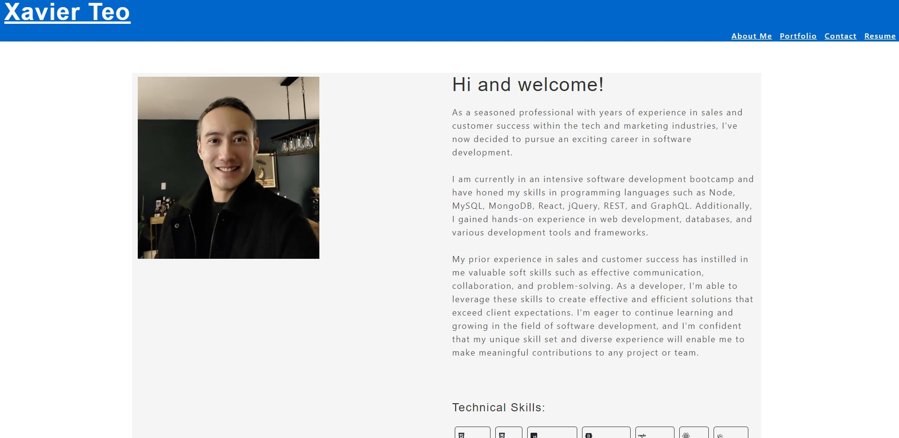
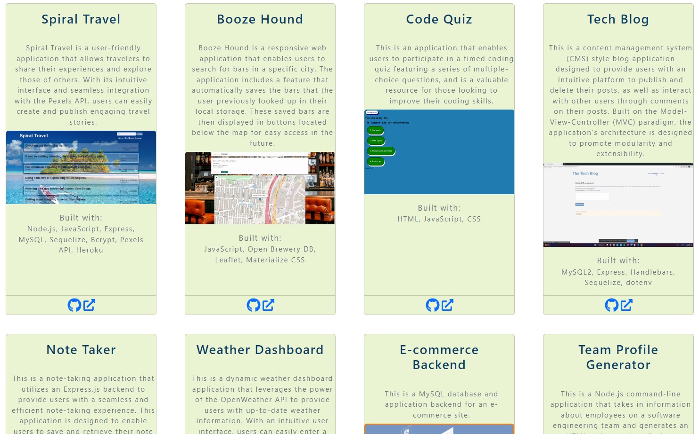
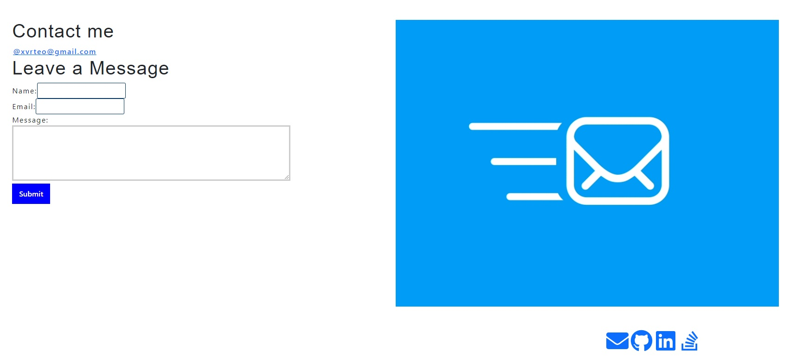

# React-Portfolio

## Description

The portfolio showcases several sections, including a header, a content section, and a footer. The header displays my name and a navigation menu with sections named About Me, Portfolio, Contact, and Resume. The About Me section provides the user with my background. Within the Portfolio section, users can view various images of applications that I've created, which link to both the deployed application and the corresponding GitHub repository. Users will be able to contact me via email in the Contact section. The Resume section has a list of my proficiencies as well as contain a button to download my resume in PDF format, while the footer provides links to my email, GitHub, LinkedIn, Stack Overflow profiles.

## Screenshots

### Links:

1. URL of the functional, deployed application: http://xvrteo.github.io/React-Portfolio
2. URL of the GitHub repository: https://github.com/XvrTeo/React-Portfolio
